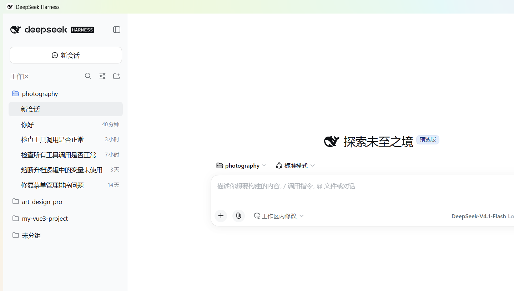

# DeepSeek Harness Desktop

[English](README.md) | [中文](README.zh.md)

## Overview

DeepSeek Harness Desktop (`dsh-desktop`) is a Windows desktop application built on the [deepseek-ai/deepseek-harness](https://github.com/deepseek-ai/deepseek-harness) kernel. It wraps the `dsh web` Web UI into a native Electron shell.

- Double-click to launch: auto-starts the bundled `dsh web` server and opens the UI in a native window
- Fully self-contained: bundles Electron 43 + Node.js 22 + the complete `@deepseek-ai/dsh` package — no system Node.js required
- Shares `~/.dsh` with the CLI version (profiles / sessions / storage all shared)
- Default working directory: `%USERPROFILE%\DeepSeekHarness`

Current version: **0.1.8** (kernel **0.1.5-rc.2**)

## Screenshot



## Project Structure

```
dsh-desktop/
├── main.js                 # Electron main process — window & kernel lifecycle, plugin install/rollback, self-heal patches
├── preload.js              # Renderer bridge — window controls, plugin jobs, settings IPC
├── app/                    # Renderer pages (loading / error / mcp / plugins / settings)
├── build/                  # Packaging scripts & assets (do-pack, NSIS, rcedit, icons, patch tools)
├── harness/                # Bundled dsh kernel (lib + node_modules)
├── runtime/                # Bundled Node.js 22 + pnpm
├── plugins/                # Built-in desktop plugins (dsh-desktop-settings)
├── patches/                # Kernel patch resources
├── docs/                   # Release notes & documentation
└── dist/                   # Build artifacts (Setup / Portable)
```

## Features

### Desktop Extensions

| Feature | Description |
| --- | --- |
| MCP auto-detection | Scans MCP configs and syncs them into the desktop app |
| Plugin market | Bundled pnpm — install/update plugins without extra setup |
| Plugin install safety | Static import precheck (incompatible plugins are rolled back *before* the kernel restarts — the session stays available during installation), hardened post-install verification, and visible auto-rollback when a bad plugin blocks startup |
| Update checker | Detects new releases from GitHub Releases and prompts download |
| Conversation & file rollback | `/rewind` command, "Rollback to this message", double-press `Esc` |
| Fullscreen | `F11` toggles fullscreen |
| Window auto-reconnect | Auto-reconnects after kernel restarts — no grey freeze |
| No-console fix | Child processes (git/pnpm/node) never open visible console windows |
| Log UX | Plugin install logs auto-collapse after 60s; one-click clear |

> The installer ships **no pre-bundled plugins** — install what you need from the built-in plugin market. A plugin that turns out to be incompatible with the current kernel is detected and rolled back automatically.

## Installation (v0.1.8)

| Artifact | Description | Download |
| --- | --- | --- |
| DeepSeek.Harness.Setup.0.1.8.exe | Installer: per-user install (no admin required), Start Menu + desktop shortcuts | [Download](https://github.com/LTJ002/DeepSeek-Harness-Desktop/releases/download/v0.1.8/DeepSeek.Harness.Setup.0.1.8.exe) |
| DeepSeek.Harness.0.1.8.Portable.exe | Portable: no installation, self-extracts and runs beside the exe | [Download](https://github.com/LTJ002/DeepSeek-Harness-Desktop/releases/download/v0.1.8/DeepSeek.Harness.0.1.8.Portable.exe) |

> GitHub Release: https://github.com/LTJ002/DeepSeek-Harness-Desktop/releases/tag/v0.1.8

### Portable Notes

- First run shows an "Initializing" progress window, which disappears automatically once the app launches
- Green / no registry writes; extract location = wherever the exe lives

## Keyboard Shortcuts

| Key | Action |
| --- | --- |
| `F11` | Toggle fullscreen |
| `Esc` | Exit fullscreen |
| Double-press `Esc` with empty input | Open "Conversation Rollback" in Web Settings |

## Logs

- Desktop app log: `%APPDATA%\DeepSeek Harness\harness.log`
- Harness data: `~/.dsh`

## Release Notes

- All releases: https://github.com/LTJ002/DeepSeek-Harness-Desktop/releases
- 0.1.8: [English](docs/RELEASE-0.1.8.en.md) | [中文](docs/RELEASE-0.1.8.zh.md)

## License

Built on the MIT-licensed [deepseek-harness](https://github.com/deepseek-ai/deepseek-harness); this project is licensed under the [MIT License](LICENSE).
